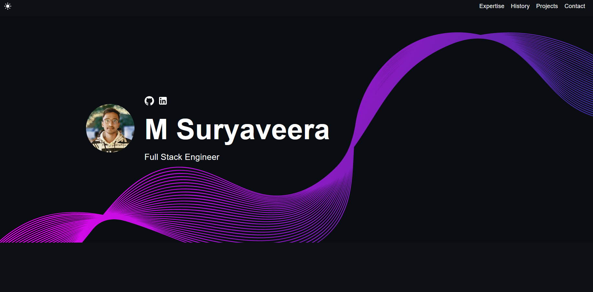

<div align="center">

# 🌟 M Suryaveera - Developer Portfolio 🌟


### 💫 Passionate Full Stack Developer & Network Engineer 💫


[](https://github.com/Suryaveera04)
[](https://github.com/Suryaveera04)

</div>

---

<div align="center">

## 🚀 Tech Stack & Expertise 🚀


</div>

<div align="center">

### 🌐 Network Engineering & Certifications 🌐


</div>

---

<div align="center">

## 🎯 About Me 🎯

</div>

<table align="center">
<tr>
<td width="50%">

### 👨‍💻 Professional Journey

🔥 **Passionate Developer** with expertise in modern web technologies  
🌐 **Network Engineer** specializing in robust infrastructure solutions  
🚀 **Innovation Enthusiast** building scalable applications  
📚 **Continuous Learner** staying ahead with latest technologies  
🎯 **Problem Solver** turning complex challenges into elegant solutions  

</td>
<td width="50%">

### 🏆 Key Achievements

✨ **CCNA Certified** Network Professional  
🎓 **Multiple Certifications** in Development & AI  
💼 **Cisco Internship** Experience  
🔧 **Full Stack Projects** with Modern Tech Stack  
🌟 **Open Source** Contributor  

</td>
</tr>
</table>

---

<div align="center">

## 💼 Portfolio Showcase 💼



</div>

---

<div align="center">

## 🛠️ Technical Arsenal 🛠️

</div>

<table align="center">
<tr>
<td width="33%" align="center">

### 🎨 Frontend Development


</td>
<td width="33%" align="center">

### ⚙️ Backend Development


</td>
<td width="33%" align="center">

### 🌐 Network & Tools


</td>
</tr>
</table>

---

<div align="center">

## 🏆 Certifications & Achievements 🏆

</div>

<div align="center">

<table>
<tr>
<td align="center" width="25%">
<br>
<b>CCNA Certificate</b><br>
<sub>Cisco Certified Network Associate</sub>
</td>
<td align="center" width="25%">
<br>
<b>Networking Essentials</b><br>
<sub>Cisco Networking Academy</sub>
</td>
<td align="center" width="25%">
<br>
<b>App Development</b><br>
<sub>Mobile Application Development</sub>
</td>
<td align="center" width="25%">
<br>
<b>Gen AI Certificate</b><br>
<sub>Generative AI & Machine Learning</sub>
</td>
</tr>
<tr>
<td align="center" width="25%">
<br>
<b>Vel-Tech Certificate</b><br>
<sub>Technical Excellence</sub>
</td>
<td align="center" width="25%">
<br>
<b>Cisco Internship</b><br>
<sub>Network Engineering Internship</sub>
</td>
<td align="center" width="25%">
<br>
<b>Full Stack Projects</b><br>
<sub>React & Node.js Applications</sub>
</td>
<td align="center" width="25%">
<br>
<b>Open Source</b><br>
<sub>Community Contributions</sub>
</td>
</tr>
</table>

</div>

---

<div align="center">

## 🌟 Portfolio Features 🌟

</div>

<table align="center">
<tr>
<td width="50%">

### ✨ Design & User Experience
- 🎨 **Responsive Design** - Seamless across all devices
- 🌙 **Dark/Light Mode** - Toggle between themes
- 🎭 **Interactive Components** - Smooth animations & transitions
- 📱 **Mobile-First** - Optimized for mobile experience
- 🎯 **Modern UI/UX** - Clean and professional interface

</td>
<td width="50%">

### 🚀 Technical Excellence
- ⚡ **React 18** - Latest React features & hooks
- 🔷 **TypeScript** - Type-safe development
- 🎨 **SCSS** - Advanced styling capabilities
- 📊 **Performance Optimized** - Fast loading & smooth interactions
- 🔧 **Modular Architecture** - Clean, maintainable code

</td>
</tr>
</table>

---

<div align="center">

## 🚀 Quick Start Guide 🚀

</div>

### 📋 Prerequisites

```bash
# Ensure you have Node.js installed (v14 or higher)
node --version
npm --version
```

### ⚡ Installation & Setup

```bash
# 1️⃣ Clone the repository
git clone https://github.com/Suryaveera04/My_portfolio2.git
cd My_portfolio2

# 2️⃣ Install dependencies
npm install

# 3️⃣ Start development server
npm start

# 4️⃣ Open in browser
# Navigate to http://localhost:3000
```

### 🏗️ Build for Production

```bash
# Create optimized production build
npm run build

# Deploy to GitHub Pages
npm run deploy
```

---

<div align="center">

## 📁 Project Architecture 📁

</div>

```
🏗️ My_portfolio2/
├── 📂 public/
│   ├── 🖼️ IMG_20250222_213651.jpg    # Profile picture
│   ├── 🌐 index.html                 # Main HTML template
│   └── 📄 manifest.json              # PWA configuration
├── 📂 src/
│   ├── 📂 assets/
│   │   ├── 🖼️ images/                # Portfolio images & certificates
│   │   └── 🎨 styles/                # SCSS stylesheets
│   ├── 📂 components/
│   │   ├── 🏠 Main.tsx               # Hero section
│   │   ├── 💼 Expertise.tsx          # Skills & expertise
│   │   ├── 🚀 Project.tsx            # Projects showcase
│   │   ├── 🏆 Certificates.tsx       # Certifications display
│   │   ├── ⏰ Timeline.tsx           # Career timeline
│   │   ├── 📞 Contact.tsx            # Contact form
│   │   └── 🧭 Navigation.tsx         # Navigation component
│   ├── 📱 App.tsx                    # Main application component
│   └── 🎯 index.tsx                  # Application entry point
├── 📦 package.json                   # Dependencies & scripts
└── 📖 README.md                      # Project documentation
```

---

<div align="center">

## 🎨 Customization Guide 🎨

</div>

<table align="center">
<tr>
<td width="50%">

### 🔧 Personal Information
- **Profile**: Update `src/components/Main.tsx`
- **Skills**: Modify `src/components/Expertise.tsx`
- **Projects**: Add to `src/components/Project.tsx`
- **Contact**: Edit `src/components/Contact.tsx`

</td>
<td width="50%">

### 🎨 Visual Elements
- **Images**: Replace files in `src/assets/images/`
- **Colors**: Customize in SCSS files
- **Fonts**: Update in `src/index.scss`
- **Animations**: Modify component styles

</td>
</tr>
</table>

---

<div align="center">

## 🚀 Deployment Options 🚀

</div>

<table align="center">
<tr>
<td width="25%" align="center">

### 📄 GitHub Pages
```bash
npm run deploy
```
**Free hosting**  
**Custom domain support**  
**Automatic SSL**

</td>
<td width="25%" align="center">

### ⚡ Vercel
```bash
vercel --prod
```
**Instant deployment**  
**Global CDN**  
**Serverless functions**

</td>
<td width="25%" align="center">

### 🌐 Netlify
```bash
netlify deploy --prod
```
**Drag & drop deploy**  
**Form handling**  
**Edge functions**

</td>
<td width="25%" align="center">

### 🔥 Firebase
```bash
firebase deploy
```
**Google infrastructure**  
**Real-time database**  
**Authentication**

</td>
</tr>
</table>

---

<div align="center">

## 📊 GitHub Statistics 📊


</div>

---

<div align="center">

## 🤝 Connect With Me 🤝

<a href="https://github.com/Suryaveera04" target="_blank">

</a>
<a href="https://www.linkedin.com/in/suryaveera-msv/" target="_blank">

</a>
<a href="mailto:contact@suryaveera.dev" target="_blank">

</a>
<a href="https://suryaveera04.github.io" target="_blank">

</a>

</div>

---

<div align="center">

## 💝 Support My Work 💝

<a href="https://github.com/Suryaveera04/My_portfolio2">

</a>

<a href="https://github.com/Suryaveera04?tab=followers">

</a>

</div>

---

<div align="center">

## 📄 License 📄

This project is licensed under the **MIT License** - see the [LICENSE](LICENSE) file for details.

---


**Made with ❤️ by M Suryaveera**


</div>